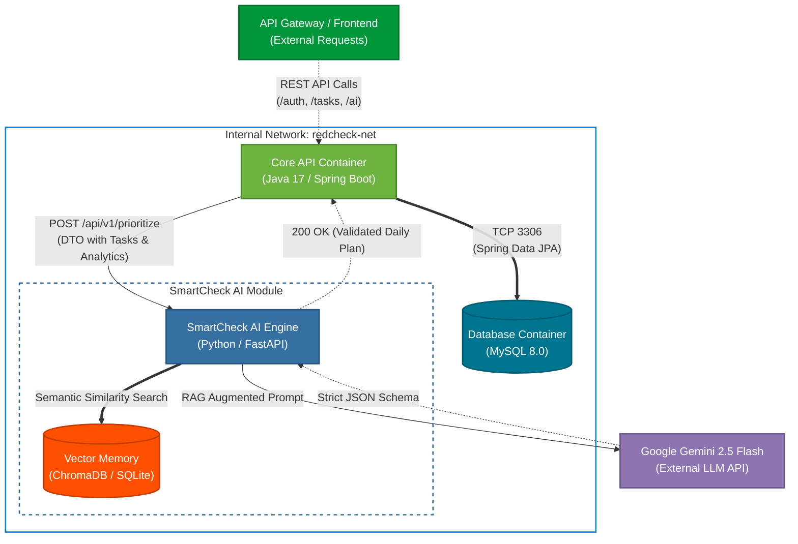

# RedCheck - Backend


> **RedCheck API** is the robust backend infrastructure that powers the intelligent task prioritization system. It handles complex data relationships, secure authentication, and the integration with external AI models.

This repository contains the **Backend** architecture. You can find the React client and User Interface in [this link](https://github.com/redcheckapp/redcheck-frontend.git). 

This project demonstrates scalable RESTful API design, rigorous security implementation, and seamless integration of artificial intelligence for background processing.

<p align="center">
  
</p>

## Key Features

The API was engineered with a focus on security, performance, and clear domain segregation.

*   **SmartCheck AI Integration:** Asynchronous communication with external LLMs. The backend constructs complex, context-aware prompts based on the user's workload, enforces strict JSON output formats, and processes the AI response for the frontend.
*   **Robust Authentication:** Secure endpoint protection utilizing Spring Security. It features stateless JWT (JSON Web Token) generation, validation, and custom filter chains for authorization.
*   **Advanced Data Management:** Relational mapping utilizing Spring Data JPA. Includes cascading soft-deletes (Trash functionality) and data isolation between users.
*   **Recurring Routines Engine:** Automated logic to calculate and generate future tasks based on custom periodicities (Daily, Weekly, Biweekly, Monthly).
*   **Internationalization (i18n) Support:** Dynamic prompt engineering that adapts the AI output language based on the client's request (`?lang=` parameters).

## Tech Stack

*   **Core:** Java 17, Spring Boot 3.x.
*   **Security:** Spring Security, JWT (JSON Web Tokens).
*   **Persistence:** Spring Data JPA, Hibernate, MySQL 8.0+.
*   **Build Tool:** Maven.

## Local Installation & Configuration

### Prerequisites
*   Java Development Kit (JDK) 17 or higher
*   Maven 3.8+
*   MySQL Server running locally or via Docker

### Steps
1. Clone the repository:
   ```bash
   git clone https://github.com/redcheckapp/redcheck-backend.git
   cd redcheck-backend
   ```
2. Database and Environment Configuration:
  Update your `src/main/resources/application.properties` with your local credentials and API keys.
  ```Properties
  # Database Configuration
  spring.datasource.url=jdbc:mysql://localhost:3306/redcheck
  spring.datasource.username=root
  spring.datasource.password=your_db_password
  spring.jpa.hibernate.ddl-auto=update

  # JWT Configuration
  jwt.secret=your_highly_secure_base64_encoded_secret_key
  jwt.expiration=86400000

  # AI Configuration
  ai.api.key=your_llm_api_key
  ```
3. Build and Run:
   ```Bash
   mvn clean install
   mvn spring-boot:run
   ```
4. The server will start on `http://localhost:8080`.

## Architecture Highlights

The codebase strictly adheres to the Controller-Service-Repository pattern, ensuring a clean separation of concerns:

  - `Controllers`: Handle HTTP requests, routing, and response formatting.

  - `Services`: Contain pure business logic and transactional boundaries.

  - `Repositories`: Interface with the MySQL database via Spring Data JPA.

  - `DTOs (Data Transfer Objects)`: Prevent data over-fetching and securely map internal entities to external payloads.



## Copyright and License
This project is licensed under the **GNU Affero General Public License v3.0 (AGPLv3)**.
